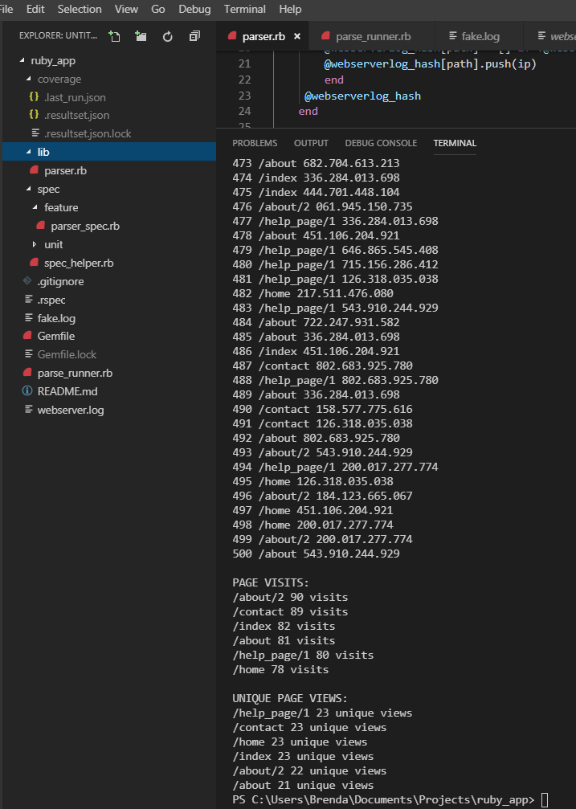

## Webserver-log-parser

This script takes a log file as an argument from the command line. It prints out in descending order the number of visits for each page, and the number of unique views per page.


## Running the script
- Clone/Fork this repo
- Navigate to the ```ruby_app``` directory
- ```bundle``` to install the dependencies
- ```ruby parse_runner.rb webserver.log``` to run the script from the script runner


## Running the tests
```rspec```

## Snapshot of test coverage


## Snapshot of script output

